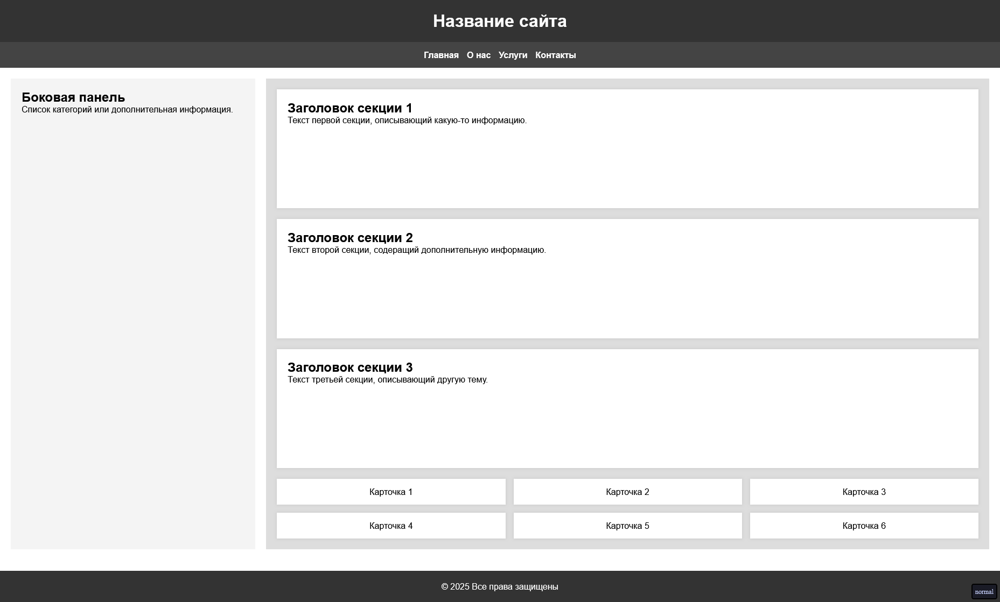

# Применение Flexbox для верстки страницы

## Цель:

Используя только CSS, оформить готовую HTML-страницу так, чтобы все элементы корректно располагались с помощью Flexbox.

_Все остальные стили кроме применения самого флекса - даны_

Условия:

- Вам дан файл index.html с готовой структурой страницы.
- Вам нужно дописать CSS-правила в styles.css, чтобы расположить элементы согласно макету, используя только Flexbox.

## Готовый макет

 

## Подсказка

### 6 карточек, где они стоят 3 в ряд

Так как у вас есть gap - отступ, там сложно подобраться к максимальному значению каждого элемента по ширине. У вас есть 2 выхода:

1. Подгадывать проценты (100% ширина всего контейнера, 100/3 = 33.33 и делаем ширину элемента вниз пока не найдем нужный
2. Рассчитать включая отступ Вы можете взять формулу `calc((100% - 2_отступа)/3)`

## Теория

### Что такое Flexbox?
`display: flex` — это способ расположения элементов в контейнере, который делает выравнивание и распределение пространства между элементами простым и предсказуемым.

### Структура
```
Flex контейнер (родитель)
    ↓
Flex элементы (дети)
```

### Оси в Flexbox

**Main Axis** (главная ось) — направление, вдоль которого располагаются элементы (по умолчанию — горизонталь, слева направо).

**Cross Axis** (поперечная ось) — перпендикулярна к главной оси (по умолчанию — вертикаль, сверху вниз).

```
┌─────────────────────────────────────┐
│  Main Axis (→)                      │
│  ┌─────────────────────────────────┤
│  │ ↓                               │
│  │ Cross Axis                      │
│  │                                 │
│  │  ┌───┐  ┌───┐  ┌───┐          │
│  │  │ 1 │  │ 2 │  │ 3 │          │
│  │  └───┘  └───┘  └───┘          │
│  │                                 │
└─────────────────────────────────────┘
```

---

## Свойства контейнера

### 1. `display: flex`
```css
.container {
  display: flex;
}
```
Включает flexbox для контейнера. Все прямые потомки становятся flex-элементами.

---

### 2. `flex-direction`
Определяет направление главной оси.

```css
.container {
  flex-direction: row;           /* слева → направо (по умолчанию) */
  flex-direction: row-reverse;   /* справа ← налево */
  flex-direction: column;        /* сверху ↓ вниз */
  flex-direction: column-reverse; /* снизу ↑ вверх */
}
```

**Визуально:**
```
row:
┌─────┬─────┬─────┐
│  1  │  2  │  3  │
└─────┴─────┴─────┘

row-reverse:
┌─────┬─────┬─────┐
│  3  │  2  │  1  │
└─────┴─────┴─────┘

column:
┌─────┐
│  1  │
├─────┤
│  2  │
├─────┤
│  3  │
└─────┘

column-reverse:
┌─────┐
│  3  │
├─────┤
│  2  │
├─────┤
│  1  │
└─────┘
```

---

### 3. `justify-content`
Выравнивание элементов **вдоль главной оси** (горизонтально при `flex-direction: row`).

```css
.container {
  justify-content: flex-start;     /* в начало (по умолчанию) */
  justify-content: flex-end;       /* в конец */
  justify-content: center;         /* в центр */
  justify-content: space-between;  /* распределить с равными промежутками */
  justify-content: space-around;   /* распределить с равными отступами вокруг */
  justify-content: space-evenly;   /* распределить равномерно */
}
```

**Визуально (при flex-direction: row):**
```
flex-start (по умолчанию):
[1][2][3]_______________

flex-end:
_______________[1][2][3]

center:
_______[1][2][3]________

space-between:
[1]_______[2]_______[3]

space-around:
__[1]____[2]____[3]__

space-evenly:
___[1]___[2]___[3]___
```

---

### 4. `align-items`
Выравнивание элементов **вдоль поперечной оси** (вертикально при `flex-direction: row`).

```css
.container {
  align-items: stretch;       /* растянуть на всю высоту (по умолчанию) */
  align-items: flex-start;    /* в начало */
  align-items: flex-end;      /* в конец */
  align-items: center;        /* в центр */
  align-items: baseline;      /* по базовой линии текста */
}
```

**Визуально:**
```
stretch (по умолчанию):
┌─────┬─────┬─────┐
│  1  │  2  │  3  │
│     │     │     │
└─────┴─────┴─────┘

flex-start:
┌─────┬─────┬─────┐
│  1  │  2  │  3  │
│     │     │     │
└─────┴─────┴─────┘

flex-end:
│     │     │     │
│  1  │  2  │  3  │
├─────┼─────┼─────┤

center:
│     │     │     │
│  1  │  2  │  3  │
│     │     │     │
└─────┴─────┴─────┘
```

---

### 5. `flex-wrap`
Определяет, будут ли элементы переноситься на новую строку.

```css
.container {
  flex-wrap: nowrap;   /* без переноса, все в одну строку (по умолчанию) */
  flex-wrap: wrap;     /* переносить на новую строку */
  flex-wrap: wrap-reverse; /* переносить в обратном направлении */
}
```

**Визуально:**
```
nowrap (по умолчанию):
[1][2][3][4][5]... (элементы сжимаются)

wrap:
[1][2][3]
[4][5]...

wrap-reverse:
[4][5]...
[1][2][3]
```

---

### 6. `align-content`
Выравнивание **строк** flex-элементов вдоль поперечной оси (работает только с `flex-wrap: wrap`).

```css
.container {
  align-content: stretch;        /* растянуть строки (по умолчанию) */
  align-content: flex-start;     /* строки в начало */
  align-content: flex-end;       /* строки в конец */
  align-content: center;         /* строки в центр */
  align-content: space-between;  /* распределить строки */
  align-content: space-around;   /* распределить с отступами */
  align-content: space-evenly;   /* распределить равномерно */
}
```

---

### 7. `gap`
Задает расстояние между элементами.

```css
.container {
  gap: 10px;              /* одинаковый зазор */
  gap: 10px 20px;         /* зазор строк и столбцов */
  row-gap: 10px;          /* зазор между строками */
  column-gap: 20px;       /* зазор между столбцами */
}
```

---

### 8. `flex-flow`
Сокращенное свойство для `flex-direction` и `flex-wrap`.

```css
.container {
  flex-flow: row wrap;
  /* эквивалентно: */
  flex-direction: row;
  flex-wrap: wrap;
}
```

---

## Свойства элементов

### 1. `flex`
Сокращенное свойство для `flex-grow`, `flex-shrink` и `flex-basis`.

```css
.item {
  flex: 1;              /* рост, сжатие, базис */
  flex: 1 0 200px;      /* grow shrink basis */
  flex: auto;           /* 1 1 auto */
  flex: none;           /* 0 0 auto */
}
```

---

### 2. `flex-grow`
Определяет, как элемент растет, если есть свободное место.

```css
.item {
  flex-grow: 0;         /* не растет (по умолчанию) */
  flex-grow: 1;         /* растет поровну с другими */
  flex-grow: 2;         /* растет в 2 раза больше */
}
```

**Пример:**
```
Если контейнер 600px, элементы 100px каждый:
[100][100][100] (300px) → свободно 300px

С flex-grow: 1 для всех:
[200][200][200]

С flex-grow: 1, 2, 1:
[150][300][150]
```

---

### 3. `flex-shrink`
Определяет, как элемент сжимается, если недостаточно места.

```css
.item {
  flex-shrink: 1;       /* сжимается поровну (по умолчанию) */
  flex-shrink: 0;       /* не сжимается */
  flex-shrink: 2;       /* сжимается в 2 раза больше */
}
```

---

### 4. `flex-basis`
Определяет базовый размер элемента ДО распределения свободного/недостающего места.

```css
.item {
  flex-basis: auto;     /* размер по содержимому (по умолчанию) */
  flex-basis: 200px;    /* фиксированный размер */
  flex-basis: 50%;      /* процент от контейнера */
  flex-basis: 0;        /* игнорирует содержимое */
}
```

---

### 5. `align-self`
Переопределяет `align-items` для конкретного элемента.

```css
.item {
  align-self: auto;       /* наследует от контейнера (по умолчанию) */
  align-self: stretch;    /* растянуть */
  align-self: flex-start; /* в начало */
  align-self: flex-end;   /* в конец */
  align-self: center;     /* в центр */
  align-self: baseline;   /* по базовой линии */
}
```

---

### 6. `order`
Изменяет визуальный порядок элементов (не меняет HTML).

```css
.item {
  order: 0;         /* по умолчанию */
  order: -1;        /* раньше других */
  order: 1;         /* позже других */
}
```

**Пример:**
```
HTML: <div>1</div><div>2</div><div>3</div>

Без order:
[1][2][3]

С order: second={order: -1}:
[2][1][3]
```


### Шпаргалка

#### Самые частые комбинации

**Центрировать всё:**
```css
.container {
  display: flex;
  justify-content: center;
  align-items: center;
}
```

**Распределить элементы по строкам:**
```css
.container {
  display: flex;
  flex-wrap: wrap;
  gap: 20px;
}
```

**Боковая панель:**
```css
.container {
  display: flex;
}

.sidebar {
  width: 250px;
}

.content {
  flex: 1;
}
```

**Равномерное распределение:**
```css
.container {
  display: flex;
  justify-content: space-between;
}
```

**Растянуть на всю ширину:**
```css
.container {
  display: flex;
  gap: 20px;
}

.item {
  flex: 1;
}
```

# Как сдавать

- Создайте форк репозитория в вашей организации с названием-этого-репозитория-вашафамилия
- Используя ветку wip сделайте задание
- Зафиксируйте изменения в вашем репозитории
- Когда документ будет готов - создайте пул реквест из ветки wip (вашей) на ветку main (тоже вашу) и укажите меня (ktkv419) как reviewer
- [Захостите работу](https://github.com/21ISR/uidev-index?tab=readme-ov-file#%D0%BA%D0%B0%D0%BA-%D1%85%D0%BE%D1%81%D1%82%D0%B8%D1%82%D1%8C-%D1%80%D0%B0%D0%B1%D0%BE%D1%82%D1%83)

Не мержите сами коммит, это сделаю я после проверки задания
